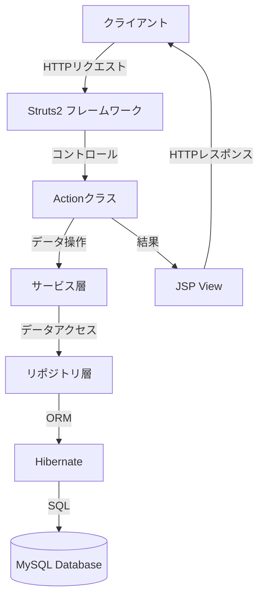

# システム概要

## 1. システム名
学生管理システム（Student Management System）

## 2. 目的
本システムは、教育機関における学生情報、コース情報、履修登録、成績管理を効率的に行うためのWebアプリケーションです。学生はシステムを通じて自身の情報管理、コース登録、成績確認などを行うことができます。

## 3. 主要機能
1. **ユーザー管理機能**
   - 学生アカウント登録
   - ログイン認証
   - ユーザー情報管理

2. **コース管理機能**
   - コース一覧表示
   - コース詳細表示
   - コース登録

3. **履修管理機能**
   - 履修コース登録
   - 履修コース一覧表示

4. **成績管理機能**
   - 成績表示（トランスクリプト）

## 4. システム構成

### 4.1 アプリケーション構成
本システムは以下の技術スタックで構成されています：

- **フロントエンド**
  - JSP (JavaServer Pages)
  - Bootstrap (UI フレームワーク)
  - jQuery

- **バックエンド**
  - Java
  - Struts 2.3 (MVCフレームワーク)
  - Hibernate (ORMフレームワーク)

- **データベース**
  - MySQL

### 4.2 システムアーキテクチャ
本システムはMVC（Model-View-Controller）アーキテクチャに基づいて設計されています：

## 5. ユーザー種別
本システムでは、以下のユーザー種別が存在します：

1. **学生**
   - システムにログイン
   - 個人情報の閲覧・更新
   - コース一覧の閲覧
   - コース登録
   - 成績の閲覧

## 6. 開発環境
- IDE: IntelliJ IDEA Ultimate Edition
- アプリケーションサーバー: Apache Tomcat
- データベース: MySQL
- ビルドツール: Maven

## 7. 動作環境
- Webブラウザ: 最新のChrome, Firefox, Safari, Edge
- サーバーOS: Windows, Linux, macOS
- クライアントOS: 制限なし（Webブラウザが動作する環境） 