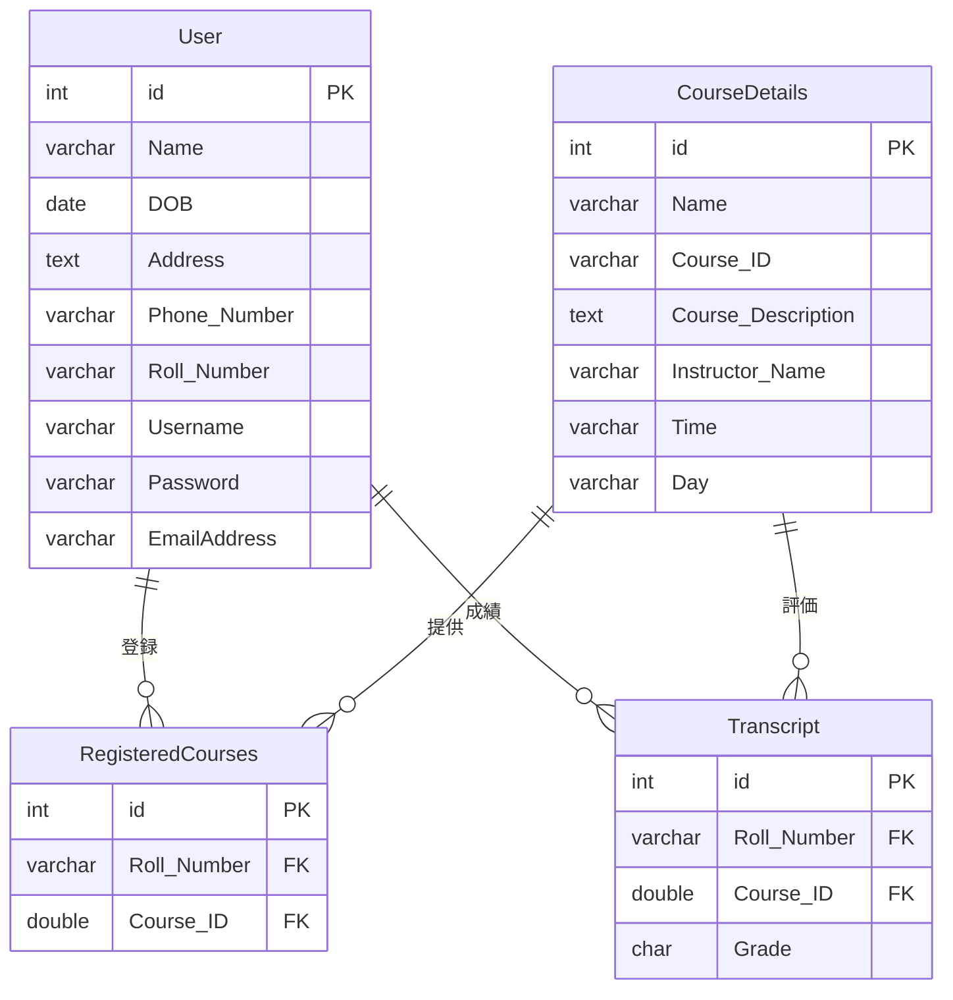

# テーブル定義

本システムで使用するデータベーステーブルの定義を以下に示します。

## 1. User テーブル

学生ユーザー情報を管理するテーブルです。

| カラム名 | データ型 | 主キー | NULL | 説明 |
|---------|---------|:----:|:----:|------|
| id | int(11) unsigned | ○ | × | ユーザーID（自動採番） |
| Name | varchar(60) | × | × | 氏名 |
| DOB | date | × | × | 生年月日 |
| Address | text | × | × | 住所 |
| Phone_Number | varchar(30) | × | × | 電話番号 |
| Roll_Number | varchar(10) | × | × | 学籍番号 |
| Username | varchar(50) | × | × | ユーザー名（ログイン用） |
| Password | varchar(50) | × | × | パスワード |
| EmailAddress | varchar(50) | × | ○ | メールアドレス |

### 制約条件
- id: 主キー、自動採番
- Username: 一意制約（ユニーク）

### インデックス
- id: 主キーインデックス
- Username: ユニークインデックス
- Roll_Number: インデックス

## 2. CourseDetails テーブル

コース情報を管理するテーブルです。

| カラム名 | データ型 | 主キー | NULL | 説明 |
|---------|---------|:----:|:----:|------|
| id | int(11) unsigned | ○ | × | コースID（自動採番） |
| Name | varchar(50) | × | × | コース名 |
| Course_ID | varchar(8) | × | × | コース識別子 |
| Course_Description | text | × | ○ | コース説明 |
| Instructor_Name | varchar(50) | × | × | 講師名 |
| Time | varchar(15) | × | × | 授業時間 |
| Day | varchar(15) | × | × | 授業曜日 |

### 制約条件
- id: 主キー、自動採番
- Course_ID: 一意制約（ユニーク）

### インデックス
- id: 主キーインデックス
- Course_ID: ユニークインデックス

## 3. RegisteredCourses テーブル

学生の履修登録情報を管理するテーブルです。

| カラム名 | データ型 | 主キー | NULL | 説明 |
|---------|---------|:----:|:----:|------|
| id | int(11) unsigned | ○ | × | 登録ID（自動採番） |
| Roll_Number | varchar(10) | × | × | 学籍番号 |
| Course_ID | double | × | × | コース識別子 |

### 制約条件
- id: 主キー、自動採番
- (Roll_Number, Course_ID): 一意制約（ユニーク）

### インデックス
- id: 主キーインデックス
- Roll_Number: インデックス
- Course_ID: インデックス

## 4. Transcript テーブル

学生の成績情報を管理するテーブルです。

| カラム名 | データ型 | 主キー | NULL | 説明 |
|---------|---------|:----:|:----:|------|
| id | int(11) unsigned | ○ | × | 成績ID（自動採番） |
| Roll_Number | varchar(10) | × | × | 学籍番号 |
| Course_ID | double | × | × | コース識別子 |
| Grade | char(1) | × | × | 成績評価（A, B, C, D, F） |

### 制約条件
- id: 主キー、自動採番
- (Roll_Number, Course_ID): 一意制約（ユニーク）

### インデックス
- id: 主キーインデックス
- Roll_Number: インデックス
- Course_ID: インデックス

## テーブル間の関連

