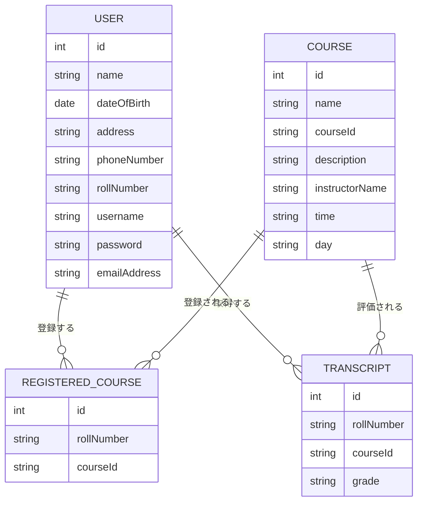
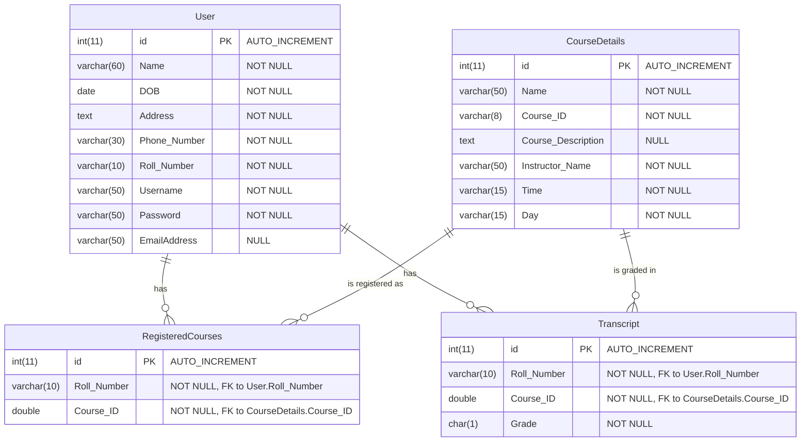

# ER図

本システムのエンティティ関連図（ER図）を以下に示します。

## 1. 概念ER図

## 2. 物理ER図

## 3. エンティティの説明

### User（ユーザー）
学生の基本情報を管理するエンティティです。ユーザー認証情報（ユーザー名、パスワード）と個人情報（氏名、生年月日、住所など）を保持します。

### CourseDetails（コース詳細）
提供されるコースの情報を管理するエンティティです。コース名、コードID、説明、担当講師、授業時間、曜日などの情報を保持します。

### RegisteredCourses（登録コース）
学生が登録したコースの情報を管理する関連エンティティです。学生（Roll_Number）とコース（Course_ID）の関連を表します。

### Transcript（成績表）
学生の各コースにおける成績情報を管理するエンティティです。学生（Roll_Number）、コース（Course_ID）、成績（Grade）の情報を保持します。

## 4. リレーションシップの説明

1. **User - RegisteredCourses**
   - 1人の学生は0以上の登録コースを持つことができます（1対多）
   - Roll_Numberを外部キーとして関連付けられています

2. **User - Transcript**
   - 1人の学生は0以上の成績情報を持つことができます（1対多）
   - Roll_Numberを外部キーとして関連付けられています

3. **CourseDetails - RegisteredCourses**
   - 1つのコースは0以上の登録情報を持つことができます（1対多）
   - Course_IDを外部キーとして関連付けられています

4. **CourseDetails - Transcript**
   - 1つのコースは0以上の成績情報を持つことができます（1対多）
   - Course_IDを外部キーとして関連付けられています 