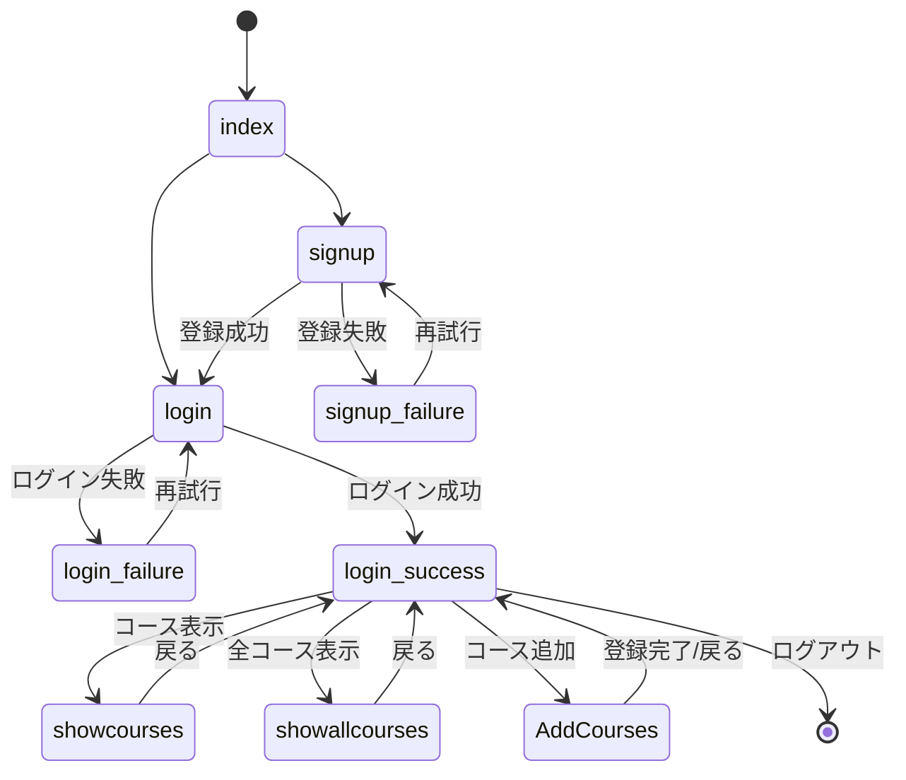

# 画面遷移

本システムの画面遷移を以下に示します。

## 1. 画面遷移図

## 2. 画面遷移の詳細説明

### 2.1 初期画面からの遷移

- **index.jsp（初期画面）**
  - ログイン画面（login.jsp）へ遷移
  - サインアップ画面（signup.jsp）へ遷移

### 2.2 ユーザー登録関連の遷移

- **signup.jsp（ユーザー登録画面）**
  - 登録成功時：ログイン画面（login.jsp）へ遷移
  - 登録失敗時：登録失敗画面（signup-failure.jsp）へ遷移

- **signup-failure.jsp（登録失敗画面）**
  - 再試行：ユーザー登録画面（signup.jsp）へ遷移

### 2.3 ログイン関連の遷移

- **login.jsp（ログイン画面）**
  - ログイン成功時：ログイン成功画面（login-success.jsp）へ遷移
  - ログイン失敗時：ログイン失敗画面（login-failure.jsp）へ遷移

- **login-failure.jsp（ログイン失敗画面）**
  - 再試行：ログイン画面（login.jsp）へ遷移

### 2.4 ログイン後の機能画面遷移

- **login-success.jsp（ログイン成功画面/メインメニュー）**
  - コース表示画面（showcourses.jsp）へ遷移
  - 全コース表示画面（showallcourses.jsp）へ遷移
  - コース追加画面（AddCourses.jsp）へ遷移
  - ログアウト：初期画面（index.jsp）へ遷移

- **showcourses.jsp（コース表示画面）**
  - 戻る：ログイン成功画面（login-success.jsp）へ遷移

- **showallcourses.jsp（全コース表示画面）**
  - 戻る：ログイン成功画面（login-success.jsp）へ遷移

- **AddCourses.jsp（コース追加画面）**
  - 登録完了/戻る：ログイン成功画面（login-success.jsp）へ遷移

## 3. 画面遷移の制約条件

1. **認証要件**
   - ログイン成功画面（login-success.jsp）以降の画面は、認証済みユーザーのみアクセス可能
   - 未認証状態でのアクセス試行時は、ログイン画面（login.jsp）へリダイレクト

2. **セッション管理**
   - ユーザーセッションはログイン時に作成され、ログアウト時に破棄される
   - セッションタイムアウト時は、ログイン画面（login.jsp）へリダイレクト

3. **バリデーション**
   - 各フォーム送信時にクライアント側およびサーバー側でバリデーションを実施
   - バリデーションエラー時は、エラーメッセージを表示して同一画面に留まる 