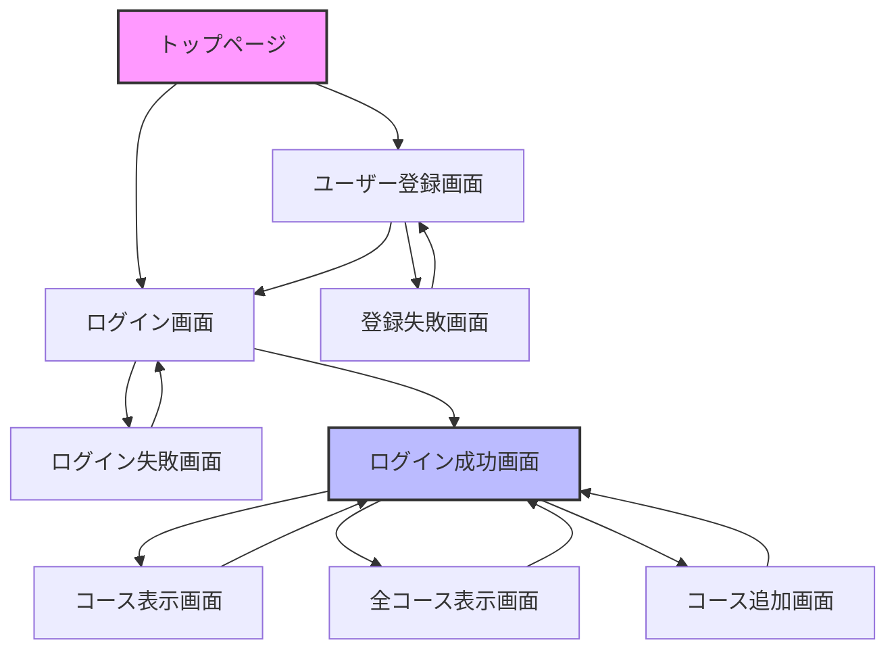

# 画面一覧

本システムで使用する画面の一覧を以下に示します。

## 1. 画面一覧表

| No. | 画面ID | 画面名 | 機能概要 | URL |
|-----|--------|--------|----------|-----|
| 1 | INDEX | トップページ | システムのトップページ | /index.jsp |
| 2 | LOGIN | ログイン画面 | ユーザー認証を行う | /WEB-INF/content/login.jsp |
| 3 | LOGIN_FAILURE | ログイン失敗画面 | ログイン失敗時のエラー表示 | /WEB-INF/content/login-failure.jsp |
| 4 | LOGIN_SUCCESS | ログイン成功画面 | ログイン後のメインメニュー | /WEB-INF/content/login-success.jsp |
| 5 | SIGNUP | ユーザー登録画面 | 新規ユーザー登録 | /WEB-INF/content/signup.jsp |
| 6 | SIGNUP_FAILURE | 登録失敗画面 | ユーザー登録失敗時のエラー表示 | /WEB-INF/content/signup-failure.jsp |
| 7 | SHOWCOURSES | コース表示画面 | 登録済みコースの表示 | /WEB-INF/content/showcourses.jsp |
| 8 | SHOWALLCOURSES | 全コース表示画面 | 全コースの一覧表示 | /WEB-INF/content/showallcourses.jsp |
| 9 | ADDCOURSES | コース追加画面 | 新規コース登録 | /WEB-INF/content/AddCourses.jsp |

## 2. 画面詳細

### 2.1 トップページ（INDEX）

- **概要**: システムのトップページ
- **URL**: /index.jsp
- **主な機能**:
  - ログイン画面へのリンク
  - ユーザー登録画面へのリンク
- **アクセス権限**: 全ユーザー

### 2.2 ログイン画面（LOGIN）

- **概要**: ユーザー認証を行う画面
- **URL**: /WEB-INF/content/login.jsp
- **主な機能**:
  - ユーザー名とパスワードによる認証
  - ユーザー登録画面へのリンク
- **入力項目**:
  - ユーザー名（必須）
  - パスワード（必須）
- **アクセス権限**: 全ユーザー

### 2.3 ログイン失敗画面（LOGIN_FAILURE）

- **概要**: ログイン失敗時のエラー表示画面
- **URL**: /WEB-INF/content/login-failure.jsp
- **主な機能**:
  - エラーメッセージの表示
  - ログイン画面への再試行リンク
- **アクセス権限**: 全ユーザー

### 2.4 ログイン成功画面（LOGIN_SUCCESS）

- **概要**: ログイン後のメインメニュー画面
- **URL**: /WEB-INF/content/login-success.jsp
- **主な機能**:
  - ユーザー情報の表示
  - 各機能へのリンク（コース表示、全コース表示、コース追加）
  - ログアウト機能
- **アクセス権限**: 認証済みユーザー

### 2.5 ユーザー登録画面（SIGNUP）

- **概要**: 新規ユーザー登録画面
- **URL**: /WEB-INF/content/signup.jsp
- **主な機能**:
  - ユーザー情報の入力と登録
  - ログイン画面へのリンク
- **入力項目**:
  - 氏名（必須）
  - 生年月日（必須）
  - 住所（必須）
  - 電話番号（必須）
  - メールアドレス（必須）
  - ユーザー名（必須）
  - パスワード（必須）
- **アクセス権限**: 全ユーザー

### 2.6 登録失敗画面（SIGNUP_FAILURE）

- **概要**: ユーザー登録失敗時のエラー表示画面
- **URL**: /WEB-INF/content/signup-failure.jsp
- **主な機能**:
  - エラーメッセージの表示
  - ユーザー登録画面への再試行リンク
- **アクセス権限**: 全ユーザー

### 2.7 コース表示画面（SHOWCOURSES）

- **概要**: 登録済みコースの表示画面
- **URL**: /WEB-INF/content/showcourses.jsp
- **主な機能**:
  - 登録済みコースの一覧表示
  - メインメニューへの戻りリンク
- **アクセス権限**: 認証済みユーザー

### 2.8 全コース表示画面（SHOWALLCOURSES）

- **概要**: 全コースの一覧表示画面
- **URL**: /WEB-INF/content/showallcourses.jsp
- **主な機能**:
  - 全コースの一覧表示
  - コース詳細情報の表示
  - メインメニューへの戻りリンク
- **アクセス権限**: 認証済みユーザー

### 2.9 コース追加画面（ADDCOURSES）

- **概要**: 新規コース登録画面
- **URL**: /WEB-INF/content/AddCourses.jsp
- **主な機能**:
  - コース選択と登録
  - メインメニューへの戻りリンク
- **入力項目**:
  - コース選択（必須）
- **アクセス権限**: 認証済みユーザー

## 3. 画面マップ

