# 画面UI

本システムの各画面のUI設計を以下に示します。

## 1. 共通UI要素

### 1.1 ヘッダー

全画面共通のヘッダー部分です。

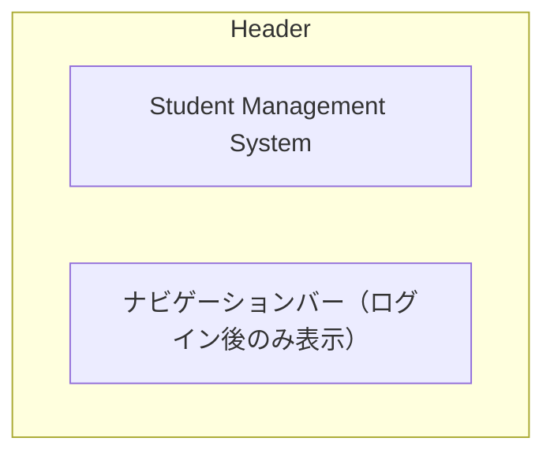

### 1.2 フッター

全画面共通のフッター部分です。

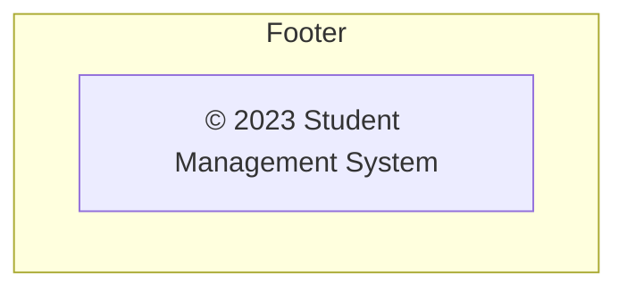

### 1.3 ナビゲーションバー（ログイン後）

ログイン後に表示されるナビゲーションバーです。

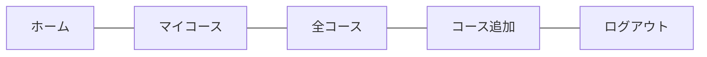

## 2. 各画面UI

### 2.1 トップページ（index.jsp）

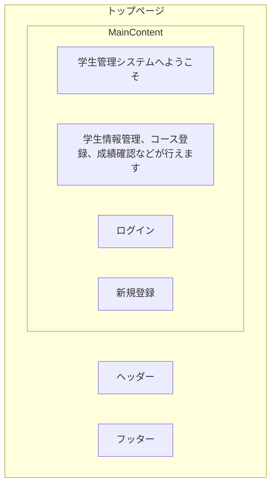

### 2.2 ログイン画面（login.jsp）

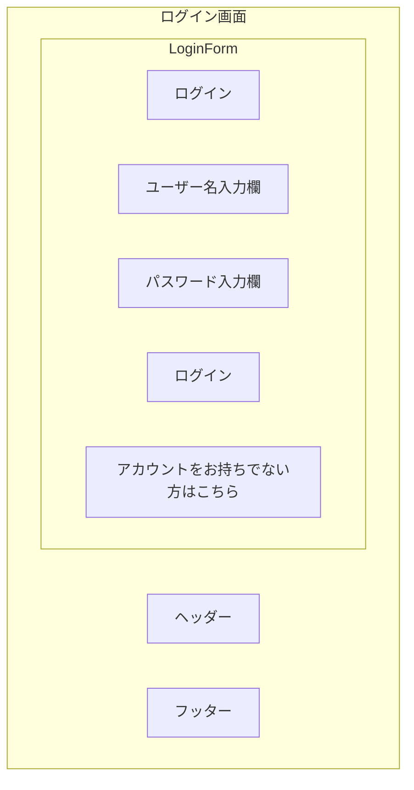

### 2.3 ユーザー登録画面（signup.jsp）

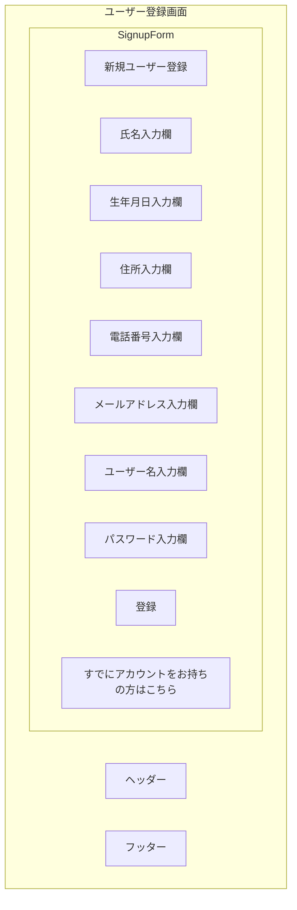

### 2.4 ログイン成功画面（login-success.jsp）

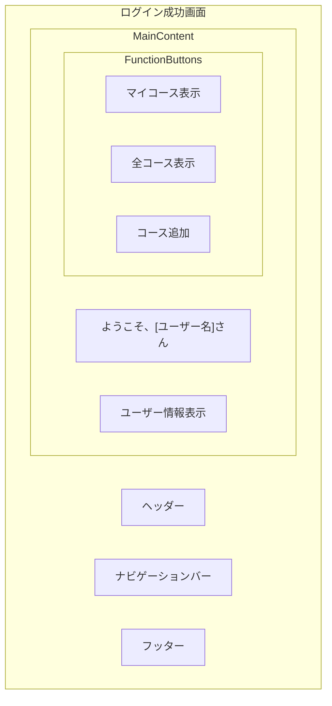

### 2.5 コース表示画面（showcourses.jsp）

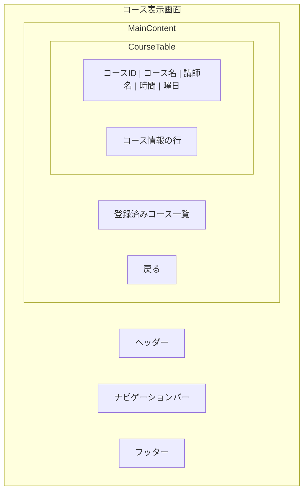

### 2.6 全コース表示画面（showallcourses.jsp）

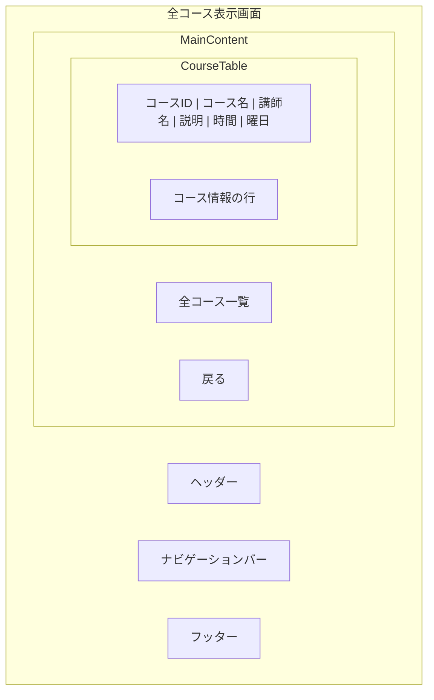

### 2.7 コース追加画面（AddCourses.jsp）

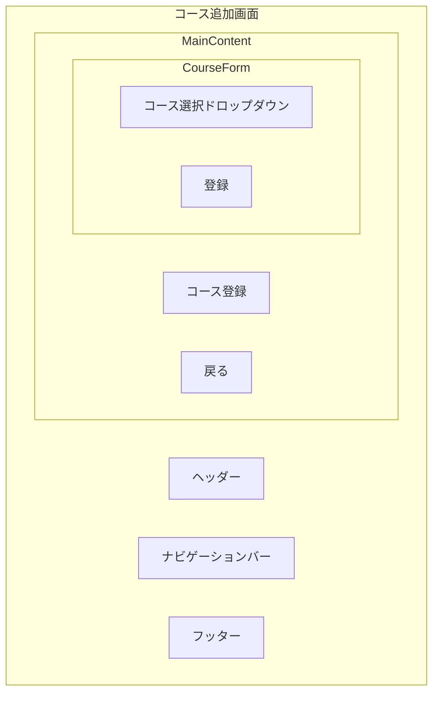

### 2.8 ログイン失敗画面（login-failure.jsp）

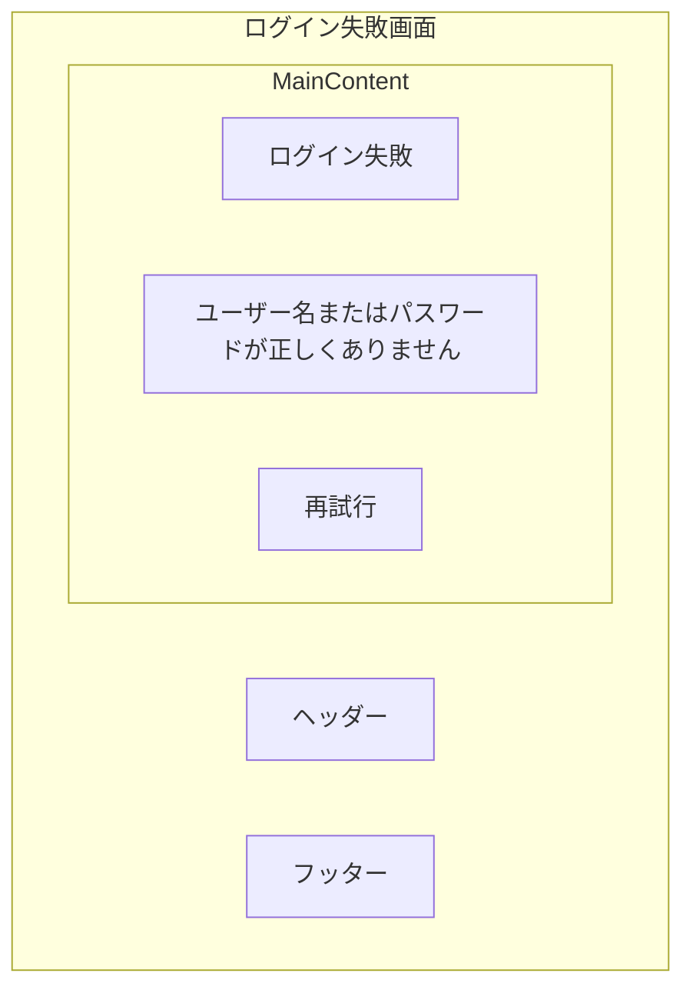

### 2.9 登録失敗画面（signup-failure.jsp）

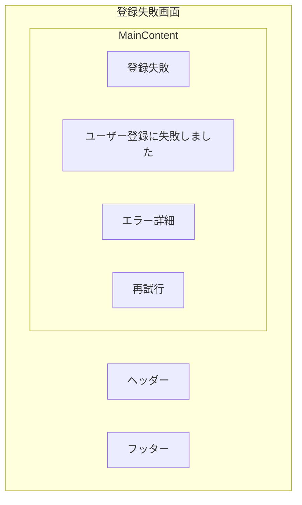

## 3. レスポンシブデザイン対応

本システムはBootstrapフレームワークを使用し、以下のブレークポイントでレスポンシブデザインに対応します。

- **スマートフォン**: 576px未満
- **タブレット**: 576px以上〜992px未満
- **デスクトップ**: 992px以上

各画面は、デバイスサイズに応じて以下のように表示が最適化されます。

### 3.1 スマートフォン表示

- ナビゲーションバーはハンバーガーメニューに折りたたまれる
- フォーム要素は縦に積み重なって表示
- テーブルは横スクロール可能な形式で表示

### 3.2 タブレット表示

- ナビゲーションバーは通常表示
- フォーム要素は2列で表示
- テーブルは適切な幅で表示

### 3.3 デスクトップ表示

- ナビゲーションバーは通常表示
- フォーム要素は複数列で表示
- テーブルは全カラムを表示 