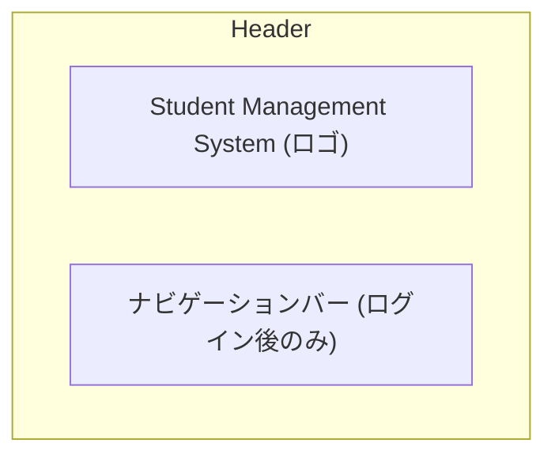
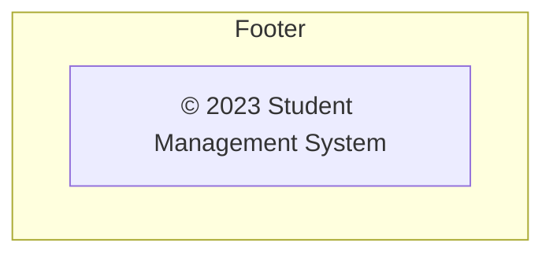
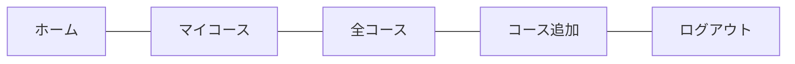
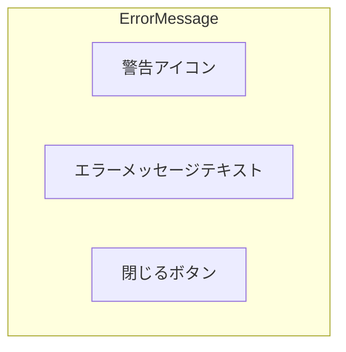
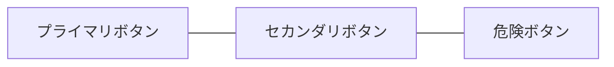
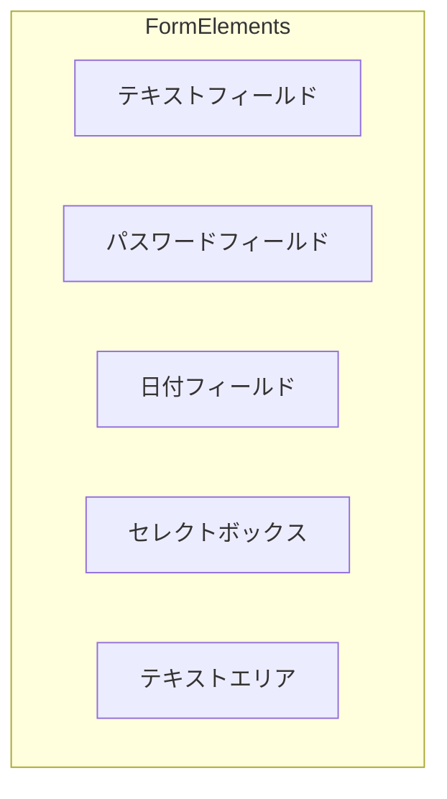
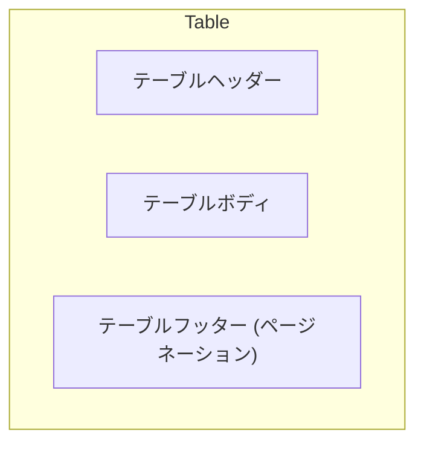

# 共通コンポーネント

本システムで使用する共通コンポーネントの設計を以下に示します。

## 1. 共通コンポーネント一覧

| No. | コンポーネント名 | 説明 | 使用画面 |
|-----|----------------|------|---------|
| 1 | ヘッダー | 全画面共通のヘッダー部分 | 全画面 |
| 2 | フッター | 全画面共通のフッター部分 | 全画面 |
| 3 | ナビゲーションバー | ログイン後に表示されるナビゲーションメニュー | ログイン後の全画面 |
| 4 | エラーメッセージ | バリデーションエラーなどを表示するコンポーネント | 全画面 |
| 5 | ボタン | システム共通のボタンスタイル | 全画面 |
| 6 | フォーム要素 | 入力フォームの共通スタイル | フォームを含む画面 |
| 7 | テーブル | データ一覧表示用の共通テーブルスタイル | 一覧表示画面 |

## 2. 共通コンポーネント詳細

### 2.1 ヘッダー

全画面共通のヘッダーコンポーネントです。



#### 実装詳細
- **ファイル**: 各JSPファイル内に直接記述
- **スタイル**: Bootstrap Navbarコンポーネントを使用
- **機能**:
  - システムロゴの表示
  - ログイン後はナビゲーションメニューの表示

### 2.2 フッター

全画面共通のフッターコンポーネントです。



#### 実装詳細
- **ファイル**: 各JSPファイル内に直接記述
- **スタイル**: Bootstrapのコンテナとテキストクラスを使用
- **機能**:
  - 著作権情報の表示

### 2.3 ナビゲーションバー

ログイン後に表示されるナビゲーションメニューです。



#### 実装詳細
- **ファイル**: 各JSPファイル内に直接記述
- **スタイル**: Bootstrap Navbarコンポーネントを使用
- **機能**:
  - 各機能画面へのリンク
  - ログアウト機能
  - レスポンシブ対応（小画面ではハンバーガーメニュー）

### 2.4 エラーメッセージ

バリデーションエラーなどを表示するコンポーネントです。



#### 実装詳細
- **ファイル**: 各JSPファイル内に条件付きで表示
- **スタイル**: Bootstrap Alertコンポーネントを使用
- **機能**:
  - エラーメッセージの表示
  - 閉じるボタンによる非表示化

### 2.5 ボタン

システム共通のボタンスタイルです。



#### 実装詳細
- **ファイル**: 各JSPファイル内に直接記述
- **スタイル**: Bootstrap Buttonコンポーネントを使用
- **種類**:
  - プライマリボタン: 主要アクション用（登録、ログインなど）
  - セカンダリボタン: 補助アクション用（戻る、キャンセルなど）
  - 危険ボタン: 削除などの危険操作用

### 2.6 フォーム要素

入力フォームの共通スタイルです。



#### 実装詳細
- **ファイル**: 各JSPファイル内に直接記述
- **スタイル**: Bootstrap Formコンポーネントを使用
- **機能**:
  - ラベル付きの入力フィールド
  - バリデーションエラー表示
  - 必須項目のマーキング

### 2.7 テーブル

データ一覧表示用の共通テーブルスタイルです。



#### 実装詳細
- **ファイル**: 各JSPファイル内に直接記述
- **スタイル**: Bootstrap Tableコンポーネントを使用
- **機能**:
  - 縞模様の行スタイル
  - レスポンシブ対応（横スクロール）
  - ソート機能（必要に応じて）

## 3. 共通コンポーネントの実装方針

### 3.1 コンポーネント化の方針

本システムでは、JSPファイル内に直接UIコンポーネントを記述する方式を採用しています。これは、Struts2フレームワークの基本的な使用方法に準拠しています。

より高度なコンポーネント化が必要な場合は、以下の方法を検討します：

1. **JSPインクルード**: 共通部品をJSPファイルとして分離し、`<jsp:include>`タグで取り込む
2. **Struts2タグライブラリ**: Struts2が提供するタグライブラリを活用する
3. **カスタムタグ**: 必要に応じてカスタムタグを作成する

### 3.2 スタイリング方針

スタイリングには、以下の方針を採用します：

1. **Bootstrapフレームワーク**: 基本的なスタイリングにはBootstrap 4を使用
2. **カスタムCSS**: 必要に応じて独自のスタイルを追加
3. **レスポンシブデザイン**: すべてのコンポーネントはレスポンシブ対応を基本とする

### 3.3 JavaScript連携

必要に応じて、以下のJavaScript連携を行います：

1. **jQuery**: DOM操作やイベント処理に使用
2. **Bootstrap JS**: モーダルやドロップダウンなどの動的コンポーネントに使用
3. **バリデーション**: クライアントサイドのバリデーションに使用

## 4. 共通コンポーネントのコード例

### 4.1 ヘッダーコンポーネント

```html
<header class="navbar navbar-expand-lg navbar-dark bg-primary">
  <div class="container">
    <a class="navbar-brand" href="#">Student Management System</a>
    
    <!-- ログイン後のみ表示 -->
    <% if (session.getAttribute("user") != null) { %>
      <button class="navbar-toggler" type="button" data-toggle="collapse" data-target="#navbarNav">
        <span class="navbar-toggler-icon"></span>
      </button>
      <div class="collapse navbar-collapse" id="navbarNav">
        <ul class="navbar-nav ml-auto">
          <li class="nav-item">
            <a class="nav-link" href="login-success.jsp">ホーム</a>
          </li>
          <li class="nav-item">
            <a class="nav-link" href="showcourses.jsp">マイコース</a>
          </li>
          <li class="nav-item">
            <a class="nav-link" href="showallcourses.jsp">全コース</a>
          </li>
          <li class="nav-item">
            <a class="nav-link" href="AddCourses.jsp">コース追加</a>
          </li>
          <li class="nav-item">
            <a class="nav-link" href="logout.jsp">ログアウト</a>
          </li>
        </ul>
      </div>
    <% } %>
  </div>
</header>
```

### 4.2 フッターコンポーネント

```html
<footer class="bg-light py-3 mt-5">
  <div class="container text-center">
    <p class="text-muted mb-0">© 2023 Student Management System</p>
  </div>
</footer>
```

### 4.3 エラーメッセージコンポーネント

```html
<% if (request.getAttribute("errorMessage") != null) { %>
  <div class="alert alert-danger alert-dismissible fade show" role="alert">
    <i class="fas fa-exclamation-circle mr-2"></i>
    <%= request.getAttribute("errorMessage") %>
    <button type="button" class="close" data-dismiss="alert" aria-label="Close">
      <span aria-hidden="true">&times;</span>
    </button>
  </div>
<% } %>
``` 