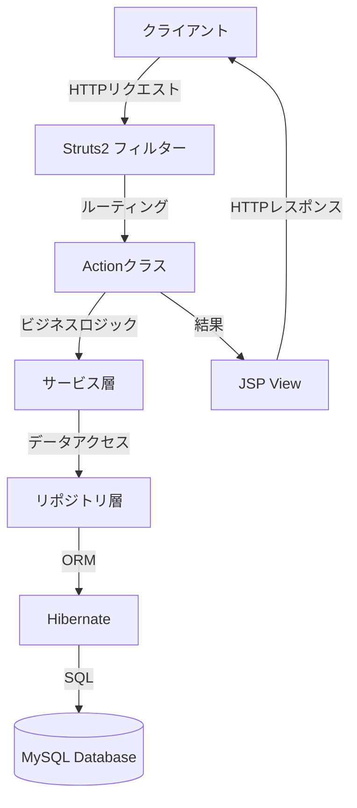
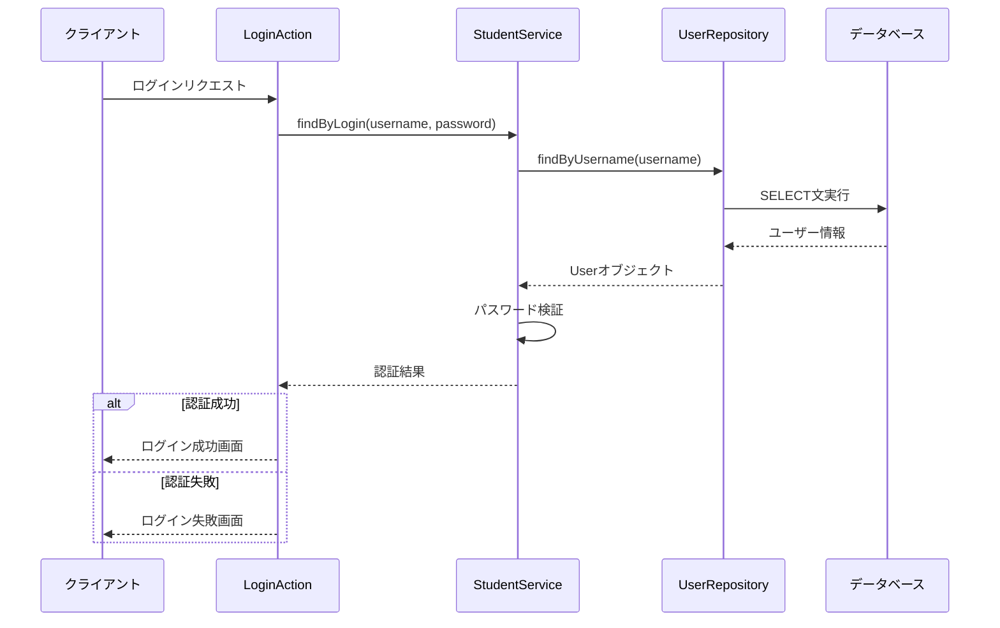
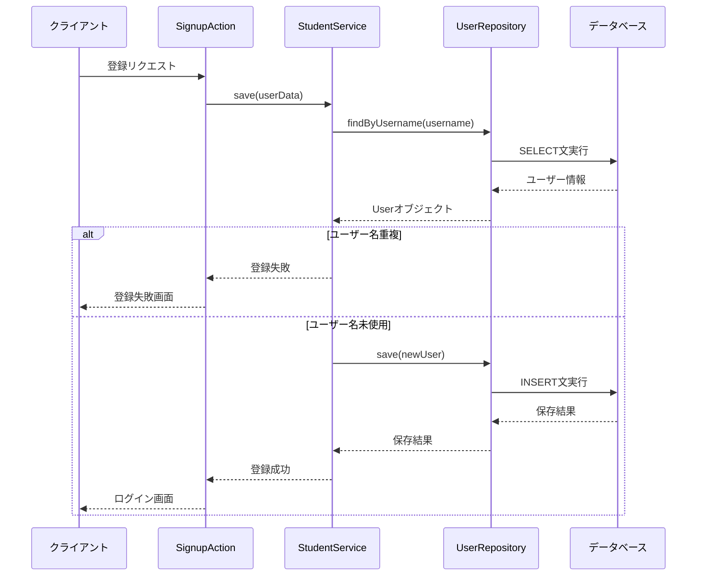
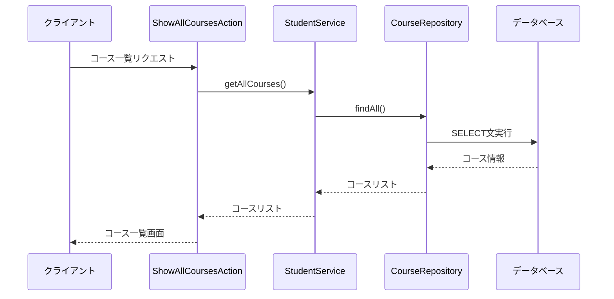
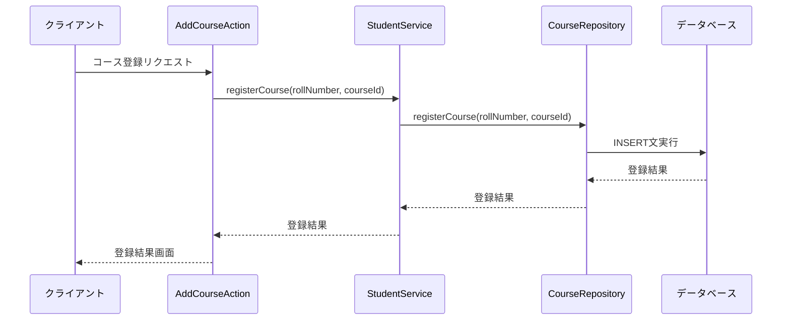

# バックエンド処理

本システムのバックエンド処理の設計を以下に示します。

## 1. バックエンド処理の全体構成

本システムのバックエンド処理は、Struts2フレームワークを中心に、以下の層で構成されています。



## 2. 各層の役割と実装

### 2.1 Actionクラス

Struts2のActionクラスは、HTTPリクエストを受け取り、適切なビジネスロジックを呼び出し、結果に応じたビューを返す役割を担います。

#### 主要なActionクラス

| クラス名 | 役割 | 主要メソッド |
|---------|------|------------|
| LoginAction | ユーザー認証処理 | execute(), input() |
| SignupAction | ユーザー登録処理 | execute(), input() |
| ShowCoursesAction | 登録済みコース表示 | execute() |
| ShowAllCoursesAction | 全コース表示 | execute() |
| AddCourseAction | コース登録処理 | execute() |

#### LoginActionの実装例

```java
package Project.actions;

import com.opensymphony.xwork2.ActionSupport;
import org.apache.struts2.convention.annotation.Action;
import Project.service.StudentService;
import com.opensymphony.xwork2.validator.annotations.RequiredStringValidator;
import com.opensymphony.xwork2.validator.annotations.StringLengthFieldValidator;
import com.opensymphony.xwork2.validator.annotations.ValidatorType;

@SuppressWarnings("serial")
public class LoginAction extends ActionSupport {

    private String pageName;
    private String userName;
    private String password;

    @Action("login-input")
    public String input() throws Exception {
        return "login";
    }

    @Action("login")
    public String execute() throws Exception {
        String result = "";
        StudentService studentService = new StudentService();

        if (pageName != null && studentService != null) {
            if (pageName.equals("login")) {
                result = studentService.findByLogin(userName, password);
                if (result.equals("LoginFailure")) {
                    return "failure";
                } else {
                    return "success";
                }
            }
        }
        return SUCCESS;
    }

    // Getters and Setters with validation annotations
    // ...
}
```

### 2.2 サービス層

サービス層は、ビジネスロジックを実装し、Actionクラスとリポジトリ層の間を仲介します。

#### 主要なサービスクラス

| クラス名 | 役割 | 主要メソッド |
|---------|------|------------|
| StudentService | 学生関連のビジネスロジック | findByLogin(), save(), getAllCourses(), getRegisteredCourses(), registerCourse() |

#### StudentServiceの実装例

```java
package Project.service;

import Project.model.User;
import Project.model.CourseDetails;
import Project.repository.UserRepository;
import Project.repository.CourseRepository;

import java.util.List;

public class StudentService {

    private UserRepository userRepository;
    private CourseRepository courseRepository;

    public StudentService() {
        userRepository = new UserRepository();
        courseRepository = new CourseRepository();
    }

    public String findByLogin(String username, String password) {
        User user = userRepository.findByUsername(username);
        if (user != null && user.getPassword().equals(password)) {
            return "LoginSuccess";
        }
        return "LoginFailure";
    }

    public String save(String firstName, String lastName, String dateOfBirth, 
                      String address, String phoneNumber, String username, 
                      String password, String emailAddress) {
        // ユーザー名の重複チェック
        if (userRepository.findByUsername(username) != null) {
            return "SignupFailure";
        }

        // 新規ユーザーの作成と保存
        User user = new User();
        user.setName(firstName + " " + lastName);
        // その他のフィールドを設定
        
        boolean success = userRepository.save(user);
        return success ? "SignupSuccess" : "SignupFailure";
    }

    public List<CourseDetails> getAllCourses() {
        return courseRepository.findAll();
    }

    public List<CourseDetails> getRegisteredCourses(String rollNumber) {
        return courseRepository.findByRollNumber(rollNumber);
    }

    public boolean registerCourse(String rollNumber, String courseId) {
        return courseRepository.registerCourse(rollNumber, courseId);
    }
}
```

### 2.3 リポジトリ層

リポジトリ層は、データアクセスロジックを実装し、Hibernateを使用してデータベースとのやり取りを行います。

#### 主要なリポジトリクラス

| クラス名 | 役割 | 主要メソッド |
|---------|------|------------|
| UserRepository | ユーザー情報のCRUD操作 | findByUsername(), save(), update() |
| CourseRepository | コース情報のCRUD操作 | findAll(), findById(), findByRollNumber(), registerCourse() |

#### UserRepositoryの実装例

```java
package Project.repository;

import Project.model.User;
import Project.util.DbUtil;
import org.hibernate.Session;
import org.hibernate.Transaction;
import org.hibernate.query.Query;

public class UserRepository {

    public User findByUsername(String username) {
        Session session = DbUtil.getSessionFactory().openSession();
        try {
            Query<User> query = session.createQuery("FROM User WHERE username = :username", User.class);
            query.setParameter("username", username);
            return query.uniqueResult();
        } finally {
            session.close();
        }
    }

    public boolean save(User user) {
        Session session = DbUtil.getSessionFactory().openSession();
        Transaction tx = null;
        try {
            tx = session.beginTransaction();
            session.save(user);
            tx.commit();
            return true;
        } catch (Exception e) {
            if (tx != null) {
                tx.rollback();
            }
            e.printStackTrace();
            return false;
        } finally {
            session.close();
        }
    }

    public boolean update(User user) {
        Session session = DbUtil.getSessionFactory().openSession();
        Transaction tx = null;
        try {
            tx = session.beginTransaction();
            session.update(user);
            tx.commit();
            return true;
        } catch (Exception e) {
            if (tx != null) {
                tx.rollback();
            }
            e.printStackTrace();
            return false;
        } finally {
            session.close();
        }
    }
}
```

### 2.4 データベース接続

Hibernateを使用してデータベースに接続します。接続設定は`hibernate.cfg.xml`ファイルで管理されます。

#### hibernate.cfg.xmlの例

```xml
<?xml version="1.0" encoding="UTF-8"?>
<!DOCTYPE hibernate-configuration PUBLIC
        "-//Hibernate/Hibernate Configuration DTD 3.0//EN"
        "http://www.hibernate.org/dtd/hibernate-configuration-3.0.dtd">
<hibernate-configuration>
    <session-factory>
        <property name="hibernate.connection.driver_class">com.mysql.jdbc.Driver</property>
        <property name="hibernate.connection.url">jdbc:mysql://localhost:3306/Project</property>
        <property name="hibernate.connection.username">root</property>
        <property name="hibernate.connection.password">password</property>
        <property name="hibernate.dialect">org.hibernate.dialect.MySQLDialect</property>
        <property name="show_sql">true</property>
        <property name="format_sql">true</property>
        <property name="hbm2ddl.auto">update</property>
        
        <mapping resource="Project/model/User.hbm.xml"/>
        <mapping resource="Project/model/CourseDetails.hbm.xml"/>
        <mapping resource="Project/model/RegisteredCourses.hbm.xml"/>
        <mapping resource="Project/model/Transcript.hbm.xml"/>
    </session-factory>
</hibernate-configuration>
```

### 2.5 データベース接続ユーティリティ

データベース接続を管理するユーティリティクラスです。

#### DbUtilの実装例

```java
package Project.util;

import org.hibernate.SessionFactory;
import org.hibernate.cfg.Configuration;

public class DbUtil {
    private static final SessionFactory sessionFactory;
    
    static {
        try {
            sessionFactory = new Configuration().configure().buildSessionFactory();
        } catch (Throwable ex) {
            System.err.println("Initial SessionFactory creation failed." + ex);
            throw new ExceptionInInitializerError(ex);
        }
    }
    
    public static SessionFactory getSessionFactory() {
        return sessionFactory;
    }
}
```

## 3. 主要なバックエンド処理フロー

以下に主要なバックエンド処理フローの概要を示します。より詳細なシーケンス図については、[詳細シーケンス図](./10_詳細シーケンス図.md)を参照してください。

### 3.1 ユーザー認証フロー



### 3.2 ユーザー登録フロー



### 3.3 コース一覧表示フロー



### 3.4 コース登録フロー



## 4. エラーハンドリング

### 4.1 例外処理の方針

本システムでは、以下の例外処理方針を採用しています：

1. **チェック例外**: ビジネスロジックに関連する例外は、適切なメッセージとともにActionクラスに伝播させ、ユーザーに通知します。
2. **非チェック例外**: システムエラーなどの予期しない例外は、グローバル例外ハンドラでキャッチし、エラーページに遷移させます。
3. **トランザクション管理**: データベース操作を含むトランザクションは、適切にロールバック処理を行います。

### 4.2 バリデーション

入力値のバリデーションは、以下の2段階で実施します：

1. **クライアントサイド**: JavaScriptを使用した即時バリデーション
2. **サーバーサイド**: Struts2のバリデーションフレームワークを使用した厳密なバリデーション

#### バリデーション例（SignupAction）

```java
@RequiredStringValidator(type = ValidatorType.FIELD, message = "UserName is a required field")
@StringLengthFieldValidator(type = ValidatorType.FIELD, maxLength = "12", minLength = "6", message = "UserName must be of length between 6 and 12")
public void setUserName(String userName) {
    this.userName = userName;
}

@RequiredStringValidator(type = ValidatorType.FIELD, message = "Password is a required field")
@StringLengthFieldValidator(type = ValidatorType.FIELD, maxLength = "12", minLength = "6", message = "Password must be of length between 6 and 12")
public void setPassword(String password) {
    this.password = password;
}

@RequiredStringValidator(type = ValidatorType.FIELD, message = "EmailAddress is a required field")
@EmailValidator(type = ValidatorType.FIELD, message = "Email Address must be valid")
public void setEmailAddress(String emailAddress) {
    this.emailAddress = emailAddress;
}
```

## 5. セキュリティ対策

### 5.1 認証・認可

- **認証**: ユーザー名とパスワードによる基本認証
- **セッション管理**: ログイン成功後にセッションにユーザー情報を保存
- **アクセス制御**: 認証済みユーザーのみがアクセスできる画面の保護

### 5.2 セキュリティ対策

- **パスワード保護**: パスワードはハッシュ化して保存（実装予定）
- **入力検証**: すべてのユーザー入力に対するバリデーション
- **SQLインジェクション対策**: Hibernateのパラメータバインディングによる保護
- **XSS対策**: 出力エスケープの徹底

## 6. パフォーマンス最適化

### 6.1 データベース最適化

- **インデックス**: 頻繁に検索されるカラムにインデックスを設定
- **接続プール**: Hibernateの接続プールを適切に設定
- **クエリ最適化**: N+1問題を回避するための適切なフェッチ戦略

### 6.2 キャッシュ戦略

- **Hibernateキャッシュ**: 2次キャッシュの設定（必要に応じて）
- **アプリケーションキャッシュ**: 頻繁にアクセスされるデータのメモリキャッシュ

## 7. 技術スタックとバージョン

本システムで使用している主要な技術スタックとそのバージョンは以下の通りです。詳細については、[アーキテクチャ詳細](./09_アーキテクチャ詳細.md)を参照してください。

| 技術/ライブラリ | バージョン | 用途 |
|---------------|----------|------|
| Java | 8 (1.8.0_xxx) | プログラミング言語 |
| Struts 2 | 2.5.25 | MVCフレームワーク |
| Hibernate | 5.4.22 | ORMフレームワーク |
| MySQL | 8.0.21 | リレーショナルデータベース |
| Tomcat | 9.0.37 | アプリケーションサーバー |
| Bootstrap | 4.5.2 | UIフレームワーク |
| jQuery | 3.5.1 | JavaScriptライブラリ | 