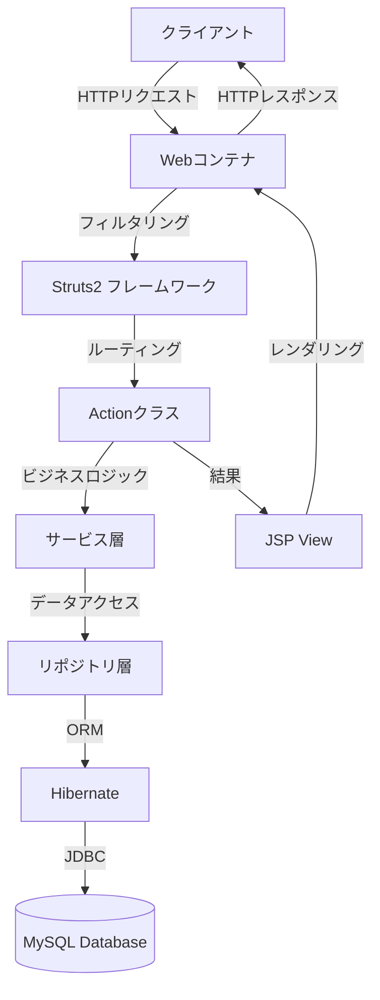
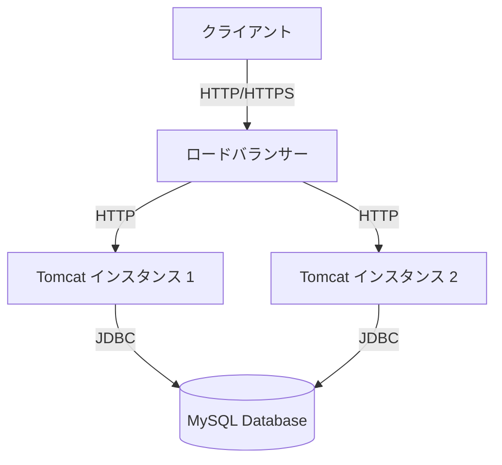

# アーキテクチャ詳細

本システムのアーキテクチャ詳細について説明します。

## 1. アーキテクチャ概要

本システムは、Java EEベースのWebアプリケーションとして実装されており、MVCアーキテクチャパターンに基づいて設計されています。



## 2. 技術スタック詳細

### 2.1 フロントエンド

| 技術/ライブラリ | バージョン | 用途 |
|---------------|----------|------|
| JSP (JavaServer Pages) | 2.3 | ビュー層の実装 |
| JSTL (JSP Standard Tag Library) | 1.2 | JSP内でのタグベースの処理 |
| Bootstrap | 4.5.2 | レスポンシブUIフレームワーク |
| jQuery | 3.5.1 | JavaScriptライブラリ |
| Font Awesome | 5.14.0 | アイコンライブラリ |

### 2.2 バックエンド

| 技術/ライブラリ | バージョン | 用途 |
|---------------|----------|------|
| Java | 8 (1.8.0_xxx) | プログラミング言語 |
| Servlet API | 4.0 | サーブレット仕様 |
| Struts 2 | 2.5.25 | MVCフレームワーク |
| Hibernate | 5.4.22 | ORMフレームワーク |
| Log4j | 2.13.3 | ロギングライブラリ |

### 2.3 データベース

| 技術/ライブラリ | バージョン | 用途 |
|---------------|----------|------|
| MySQL | 8.0.21 | リレーショナルデータベース |
| MySQL Connector/J | 8.0.21 | JDBCドライバ |
| HikariCP | 3.4.5 | コネクションプール |

### 2.4 ビルド・開発環境

| 技術/ライブラリ | バージョン | 用途 |
|---------------|----------|------|
| Maven | 3.6.3 | ビルド管理ツール |
| Tomcat | 9.0.37 | アプリケーションサーバー |
| JUnit | 5.6.2 | テストフレームワーク |
| Mockito | 3.4.6 | モックフレームワーク |

## 3. アーキテクチャ層の詳細

### 3.1 プレゼンテーション層

プレゼンテーション層は、ユーザーインターフェースとユーザーとのインタラクションを担当します。

#### 主要コンポーネント

- **JSPページ**: ビューの実装
- **Struts2アクション**: コントローラーの役割
- **Struts2インターセプター**: クロスカッティングコンサーン（認証、ロギングなど）の処理

#### 依存関係

- プレゼンテーション層はサービス層に依存
- UIコンポーネントはBootstrapとjQueryに依存

### 3.2 サービス層

サービス層は、ビジネスロジックとトランザクション管理を担当します。

#### 主要コンポーネント

- **サービスクラス**: ビジネスロジックの実装
- **DTOクラス**: データ転送オブジェクト
- **バリデーションロジック**: 入力データの検証

#### 依存関係

- サービス層はリポジトリ層に依存
- トランザクション境界はこの層で定義

### 3.3 リポジトリ層

リポジトリ層は、データアクセスロジックとデータベースとのインタラクションを担当します。

#### 主要コンポーネント

- **リポジトリクラス**: データアクセスロジックの実装
- **エンティティクラス**: データベーステーブルのマッピング
- **クエリ**: データベースクエリの実行

#### 依存関係

- リポジトリ層はHibernateに依存
- エンティティマッピングはHibernateアノテーションまたはXMLで定義

### 3.4 データベース層

データベース層は、データの永続化と取得を担当します。

#### 主要コンポーネント

- **MySQL**: リレーショナルデータベース
- **テーブル**: データ構造の定義
- **インデックス**: パフォーマンス最適化

#### 依存関係

- JDBCドライバを通じてJavaアプリケーションと接続
- Hibernateによって抽象化されたアクセス

## 4. 主要なフレームワークの設定

### 4.1 Struts2の設定

Struts2の設定は、`struts.xml`ファイルで管理されています。

```xml
<?xml version="1.0" encoding="UTF-8" ?>
<!DOCTYPE struts PUBLIC
    "-//Apache Software Foundation//DTD Struts Configuration 2.5//EN"
    "http://struts.apache.org/dtds/struts-2.5.dtd">
<struts>
    <constant name="struts.devMode" value="false" />
    <constant name="struts.custom.i18n.resources" value="global" />
    
    <package name="default" namespace="/" extends="struts-default">
        <action name="index">
            <result>/index.jsp</result>
        </action>
        
        <action name="login" class="Project.actions.LoginAction">
            <result name="success">/WEB-INF/content/login-success.jsp</result>
            <result name="failure">/WEB-INF/content/login-failure.jsp</result>
            <result name="input">/WEB-INF/content/login.jsp</result>
        </action>
        
        <action name="signup" class="Project.actions.SignupAction">
            <result name="success">/WEB-INF/content/login.jsp</result>
            <result name="failure">/WEB-INF/content/signup-failure.jsp</result>
            <result name="input">/WEB-INF/content/signup.jsp</result>
        </action>
        
        <!-- その他のアクション定義 -->
    </package>
</struts>
```

### 4.2 Hibernateの設定

Hibernateの設定は、`hibernate.cfg.xml`ファイルで管理されています。

```xml
<?xml version="1.0" encoding="UTF-8"?>
<!DOCTYPE hibernate-configuration PUBLIC
        "-//Hibernate/Hibernate Configuration DTD 3.0//EN"
        "http://www.hibernate.org/dtd/hibernate-configuration-3.0.dtd">
<hibernate-configuration>
    <session-factory>
        <!-- データベース接続設定 -->
        <property name="hibernate.connection.driver_class">com.mysql.cj.jdbc.Driver</property>
        <property name="hibernate.connection.url">jdbc:mysql://localhost:3306/Project?useSSL=false&amp;serverTimezone=UTC</property>
        <property name="hibernate.connection.username">root</property>
        <property name="hibernate.connection.password">password</property>
        
        <!-- Hibernate設定 -->
        <property name="hibernate.dialect">org.hibernate.dialect.MySQL8Dialect</property>
        <property name="show_sql">true</property>
        <property name="format_sql">true</property>
        <property name="hbm2ddl.auto">update</property>
        
        <!-- コネクションプール設定 -->
        <property name="hibernate.c3p0.min_size">5</property>
        <property name="hibernate.c3p0.max_size">20</property>
        <property name="hibernate.c3p0.timeout">300</property>
        <property name="hibernate.c3p0.max_statements">50</property>
        <property name="hibernate.c3p0.idle_test_period">3000</property>
        
        <!-- マッピングファイル -->
        <mapping resource="Project/model/User.hbm.xml"/>
        <mapping resource="Project/model/CourseDetails.hbm.xml"/>
        <mapping resource="Project/model/RegisteredCourses.hbm.xml"/>
        <mapping resource="Project/model/Transcript.hbm.xml"/>
    </session-factory>
</hibernate-configuration>
```

### 4.3 Webアプリケーション設定

Webアプリケーションの設定は、`web.xml`ファイルで管理されています。

```xml
<?xml version="1.0" encoding="UTF-8"?>
<web-app xmlns="http://xmlns.jcp.org/xml/ns/javaee"
         xmlns:xsi="http://www.w3.org/2001/XMLSchema-instance"
         xsi:schemaLocation="http://xmlns.jcp.org/xml/ns/javaee http://xmlns.jcp.org/xml/ns/javaee/web-app_4_0.xsd"
         version="4.0">
    
    <display-name>Student Management System</display-name>
    
    <!-- Struts2フィルター設定 -->
    <filter>
        <filter-name>struts2</filter-name>
        <filter-class>org.apache.struts2.dispatcher.filter.StrutsPrepareAndExecuteFilter</filter-class>
    </filter>
    
    <filter-mapping>
        <filter-name>struts2</filter-name>
        <url-pattern>/*</url-pattern>
    </filter-mapping>
    
    <!-- セッション設定 -->
    <session-config>
        <session-timeout>30</session-timeout>
    </session-config>
    
    <!-- ウェルカムファイル設定 -->
    <welcome-file-list>
        <welcome-file>index.jsp</welcome-file>
    </welcome-file-list>
    
    <!-- エラーページ設定 -->
    <error-page>
        <error-code>404</error-code>
        <location>/error/404.jsp</location>
    </error-page>
    
    <error-page>
        <error-code>500</error-code>
        <location>/error/500.jsp</location>
    </error-page>
</web-app>
```

## 5. デプロイメント構成

### 5.1 アプリケーションサーバー構成

本システムは、Apache Tomcat 9.0.37上で動作するように設計されています。



### 5.2 ファイル構成

アプリケーションのデプロイメントファイル構成は以下の通りです：

```
StudentManagementSystem.war
├── META-INF/
│   └── MANIFEST.MF
├── WEB-INF/
│   ├── classes/
│   │   └── Project/
│   │       ├── actions/
│   │       ├── model/
│   │       ├── repository/
│   │       ├── service/
│   │       └── util/
│   ├── lib/
│   │   ├── struts2-core-2.5.25.jar
│   │   ├── hibernate-core-5.4.22.jar
│   │   └── ... (その他の依存ライブラリ)
│   ├── content/
│   │   ├── login.jsp
│   │   ├── login-success.jsp
│   │   └── ... (その他のJSPファイル)
│   ├── web.xml
│   └── struts.xml
├── index.jsp
├── css/
│   └── bootstrap.min.css
├── js/
│   ├── jquery.min.js
│   └── bootstrap.min.js
└── ... (その他の静的リソース)
```

## 6. パフォーマンスと拡張性

### 6.1 パフォーマンス最適化

本システムでは、以下のパフォーマンス最適化を実施しています：

1. **データベース最適化**
   - インデックス設計
   - クエリ最適化
   - コネクションプールの使用

2. **アプリケーション最適化**
   - Hibernateの2次キャッシュ
   - 静的リソースのキャッシュ
   - レスポンスの圧縮

3. **フロントエンド最適化**
   - CSS/JSの最小化
   - 画像の最適化
   - 非同期ローディング

### 6.2 拡張性設計

本システムは、将来の拡張を考慮して以下の設計を採用しています：

1. **モジュール化**
   - 層ごとの明確な責任分担
   - 疎結合な設計

2. **スケーラビリティ**
   - ステートレスなアプリケーション設計
   - 水平スケーリングの容易さ

3. **拡張ポイント**
   - プラグイン可能なアーキテクチャ
   - 設定による機能拡張 