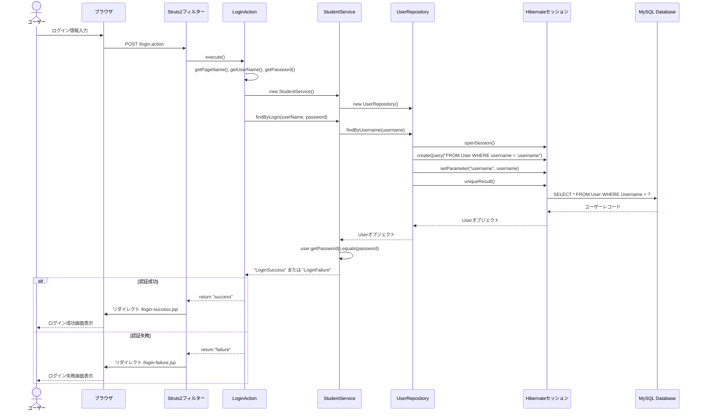
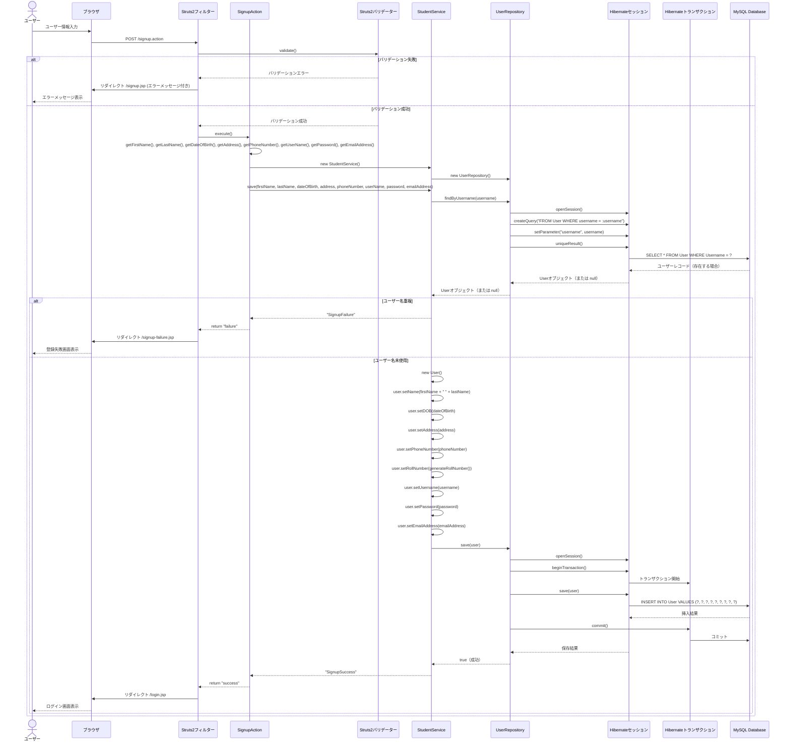
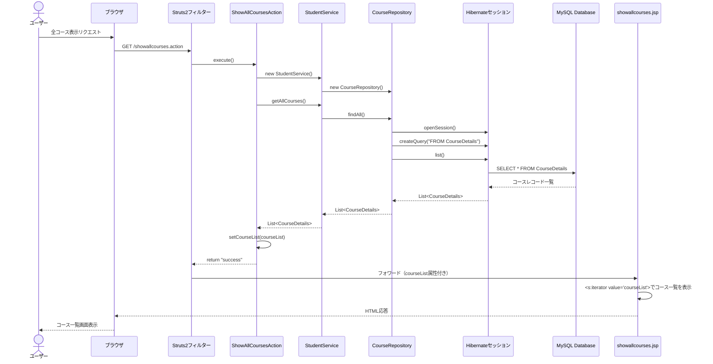
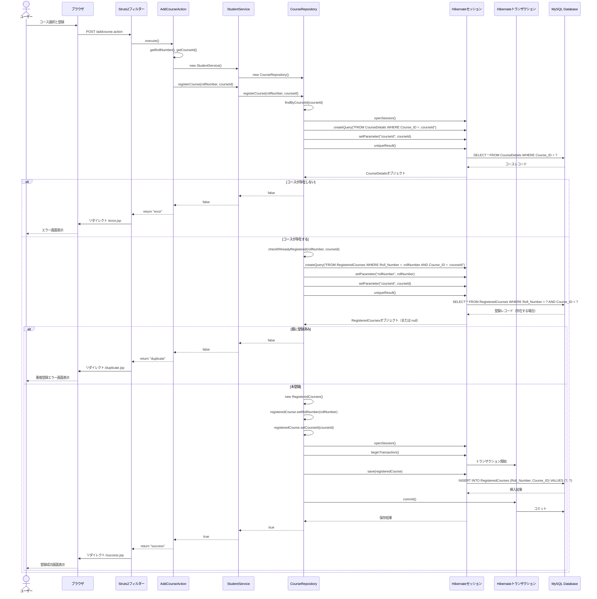
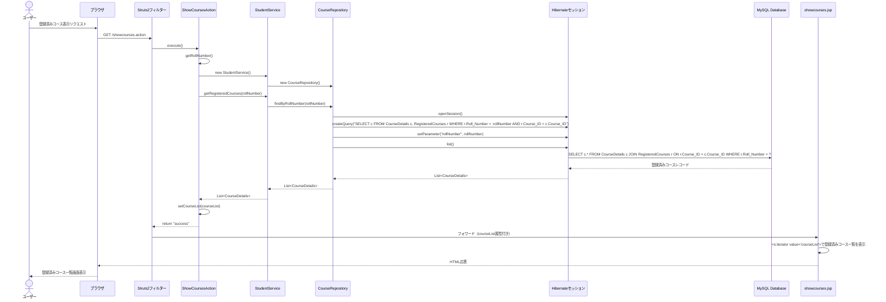
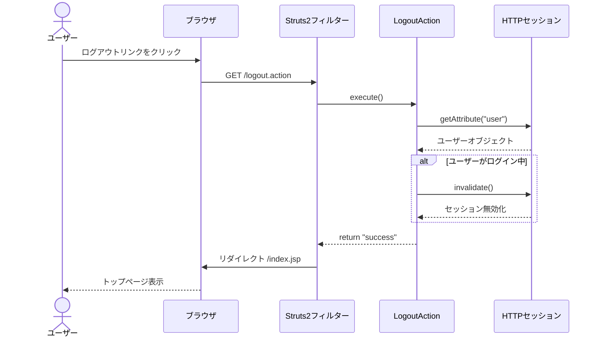
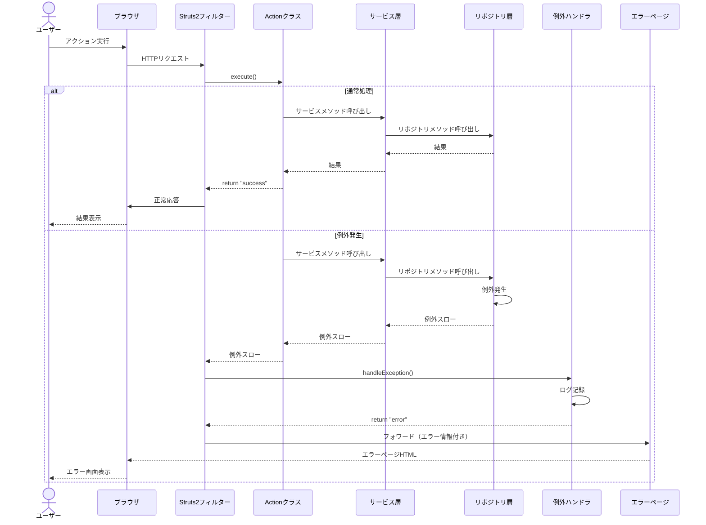

# 詳細シーケンス図

本システムの主要な処理フローを詳細なシーケンス図で説明します。

## 1. ユーザー認証フロー（詳細）

以下は、ユーザーがログインする際の詳細なシーケンス図です。

## 2. ユーザー登録フロー（詳細）

以下は、新規ユーザーが登録する際の詳細なシーケンス図です。

## 3. コース一覧表示フロー（詳細）

以下は、全コース一覧を表示する際の詳細なシーケンス図です。

## 4. コース登録フロー（詳細）

以下は、学生がコースを登録する際の詳細なシーケンス図です。

## 5. 登録済みコース表示フロー（詳細）

以下は、学生が自分の登録済みコースを表示する際の詳細なシーケンス図です。

## 6. ログアウトフロー（詳細）

以下は、ユーザーがログアウトする際の詳細なシーケンス図です。

## 7. エラーハンドリングフロー（詳細）

以下は、システムでエラーが発生した際の詳細なシーケンス図です。

